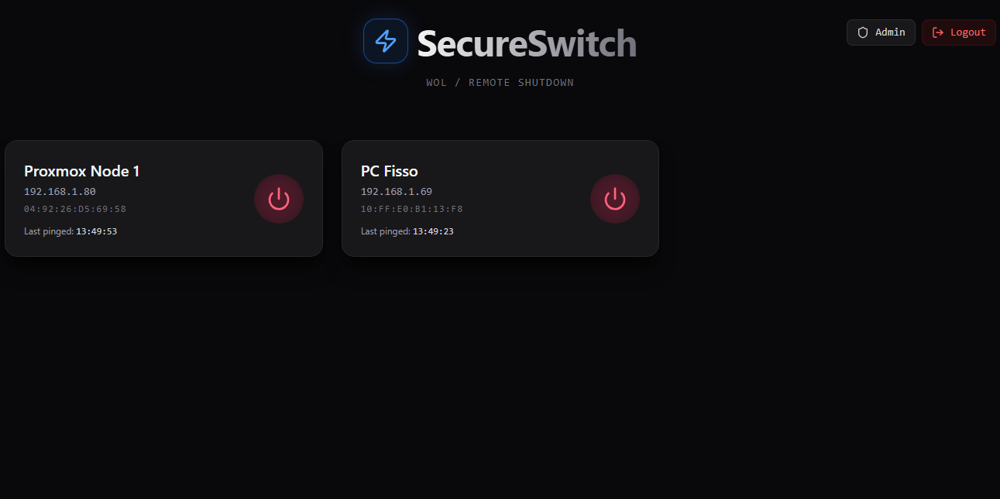
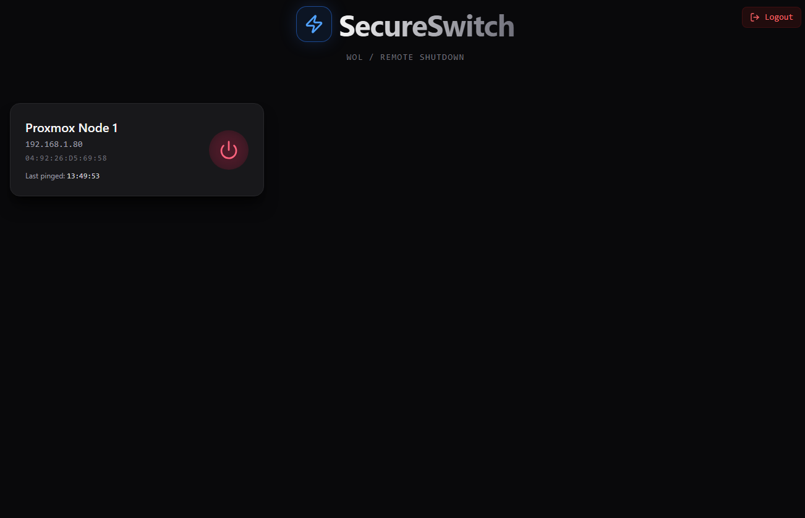
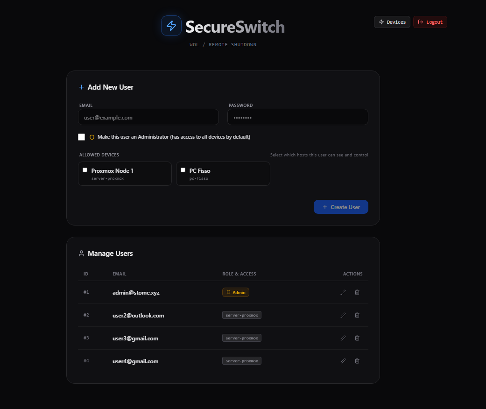

# WOL-Secure-lightSwitch (SecureSwitch)

SecureSwitch is a modern, lightweight, and secure web application to manage Wake-on-LAN (WOL) and remote shutdown for devices on your network. Built with a Go backend and a React frontend, it provides a user-friendly interface to track device status, wake them up, and shut them down securely.

## Features

- **Wake-on-LAN (WOL):** Easily wake up machines on your local network using Magic Packets.
- **Remote Shutdown:** Securely shut down devices via SSH commands (supports both password and SSH key authentication).
- **Ping Monitoring:** Real-time online/offline status tracking for your configured devices.
- **Role-Based Access Control:** 
  - **Admins:** Can manage users, assign devices, and control any device.
  - **Standard Users:** Can only view and control the specific devices assigned to them by an admin.
- **First-time Setup:** The system automatically prompts you to create the initial administrative account.
- **Dockerized:** Simple and clean deployment using Docker Compose.

## 📸 Screenshots

<div align="center">
  <table>
    <tr>
      <td align="center">
        <b>Admin View</b><br>
        <br>
        <i>Main dashboard for administrators, showing all devices</i>
      </td>
    </tr>
    <tr>
      <td align="center">
        <b>User View</b><br>
        <br>
        <i>Restricted dashboard for standard users, showing only the selected devices</i>
      </td>
    </tr>
    <tr>
      <td align="center" colspan="2">
        <b>Admin Panel</b><br>
        <br>
        <i>User management interface for admins</i>
      </td>
    </tr>
  </table>
</div>

---

## 🚀 Getting Started (Using Docker)

The easiest way to run WOL Secure LightSwitch is via Docker. 

### 1. Prerequisites
- [Docker](https://docs.docker.com/get-docker/) and [Docker Compose](https://docs.docker.com/compose/install/) installed on your server.

### 2. Configuration
Create a `docker-compose.yml` file on your server (or use the one provided in the repository [docker-compose.yml](https://github.com/LoStome/WOL-Secure-lightSwitch/blob/main/docker-compose.yml)):

```yaml
version: '3.8'

services:
  wol-switch:
    image: lostome/wol_secure_lightswitch:latest
    platform: linux/arm64 # Change to linux/amd64 if not using an ARM device like Raspberry Pi
    container_name: wol_secure_lightswitch
    restart: unless-stopped
    network_mode: host # Fundamental for Wake-on-LAN to broadcast correctly
    environment:
      - PORT=7500 # Change this port to your liking
      - TZ=Europe/Rome # Change this to your desired timezone
    volumes:
      - ./data:/app/data # This is where your hosts.yaml and database will live
      - /home/user/.ssh:/app/data/.ssh:ro # this is needed for key-based auth if you want to use it
```
*Note for SSH Keys: you could also just copy the keys into a data/ssh folder and not reference them in the hosts.yaml file. This is not recommended for security reasons.*

### 3. Define Your Devices
In the same directory as your `docker-compose.yml`, create a `data` folder and inside it, create a `hosts.yaml` file based on this structure (see also [data/hosts.yaml.example](https://github.com/LoStome/WOL-Secure-lightSwitch/blob/main/data/hosts.yaml.example)):

```yaml
# Example hosts.yaml
- id: server-proxmox
  name: "Proxmox Node 1"
  mac: "AA:BB:CC:DD:EE:FF"
  ip: "192.168.1.101" 
  user: "switchbot"
  password: "your_password" # Leave empty if not using password-based auth
  key_path: "/app/data/.ssh/id_rsa" # Leave empty if not using key-based auth. Must map to a path inside the container!
  cmd: "sudo -n /usr/sbin/poweroff"
  ping_interval: 15
  skip_interfaces: ["Tailscale", "vEthernet", "Loopback", "Bluetooth"]

- id: pc-gaming
  name: "PC Gaming Windows"
  mac: "11:22:33:44:55:66"
  ip: "192.168.1.100"
  user: "windows_user"
  password: "windows_password" 
  key_path: "/app/data/.ssh/id_ed25519"
  cmd: "shutdown /s /t 0"
  ping_interval: 30
  skip_interfaces: ["docker", "veth", "br-"]
```

## 🔐 Remote Shutdown Setup (Linux)

To allow SecureSwitch to shut down your Linux machine, you need to configure the target system to allow the `poweroff` command without manual password entry.

- *Notes:*
  - *This is needed only if you want to use the shutdown feature.*
  - *Password and key are used only for logging into your machine, not for the shutdown command.*

### 1. Create a Dedicated User (Recommended)
For better security, it is best to use a dedicated user (e.g., `switchbot`) instead of `root`. Run these commands on your Linux shell:

```bash
# Create the user
sudo adduser switchbot

# Add the user to the sudo group
sudo usermod -aG sudo switchbot
```

### 2. Enable Passwordless Shutdown
By default, sudo asks for a password. Since SecureSwitch runs automatically, you must create an exception for the shutdown command.

Create a specific sudoers file:

```bash
sudo nano /etc/sudoers.d/switchbot
```

Paste the following line (replace switchbot with your chosen username):

```plaintext
switchbot ALL=(ALL) NOPASSWD: /usr/sbin/poweroff, /usr/sbin/shutdown
```

Save and exit (Ctrl+O, Enter, Ctrl+X).

### 3. Verify Your hosts.yaml Configuration
Ensure your hosts.yaml matches the setup. Use the `-n` (non-interactive) flag in the command to prevent the application from hanging if permissions are misconfigured:

```yaml
- id: server-proxmox
  name: "Proxmox Node"
  ip: "192.168.1.101"
  user: "switchbot"
  password: "your_password" # or use key_path (password and key are used only for logging in, not for the shutdown command)
  cmd: "sudo -n /usr/sbin/poweroff"
```


### 4. Run the Service
Start the container in the background:
```bash
docker compose up -d
```

---

## 🖥️ Usage & First-Time Setup

1. **Access the Web Interface:** Open your browser and navigate to `http://<your-server-ip>:7500` (or whatever `PORT` you configured).
2. **Initial Setup:** On the first visit, the system will recognize that no users exist and will prompt you to create the first account. This account will automatically be granted **Admin privileges**.
3. **Admin Dashboard:** 
   - Once logged in as an Admin, you can see all devices defined in your `hosts.yaml`.
   - You can create new users and explicitly assign specific devices to them.
   - For instance, you can give your friend access *only* to their own gaming PC to turn it on remotely.
4. **Controlling Devices:** Click on a device card to wake it up or shut it down. The online indicator will show you if the device responds to pings.

---